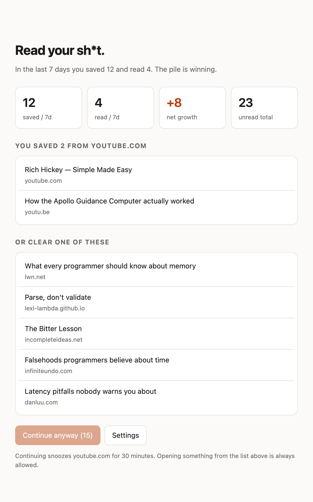
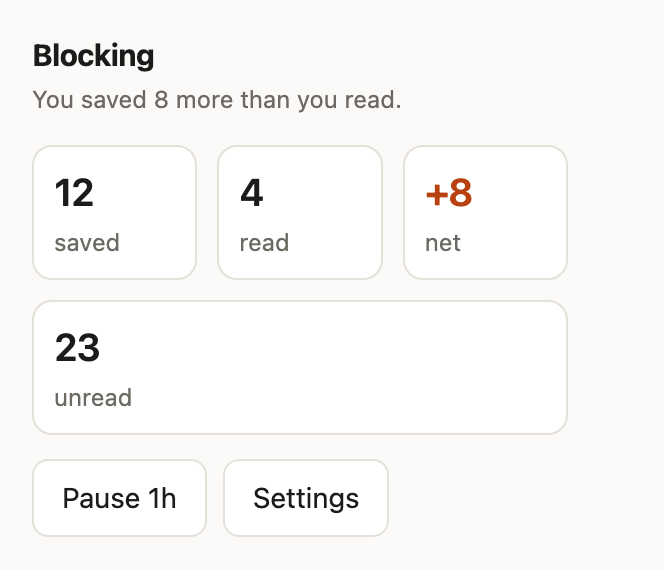

# Read Your Sheet

A Chrome extension that soft-blocks distracting sites while your Reading List is
growing faster than you read it.

It is deliberately **not** a hard blocker. When you hit a blocked site it shows a
nag screen with your actual numbers, makes you sit for a few seconds, offers you
something from your own Reading List instead — and then lets you through if you
still want to go. The point is friction, not a lock. Sometimes you genuinely need
YouTube at work.



<sub>Screenshots use example data.</sub>

Requires **Chrome 120 or newer** (that is when the `chrome.readingList` API
shipped). Desktop only — Chrome on Android and iOS don't support extensions.

---

## Install

There is no build step and no dependencies. You load the folder as-is.

1. Clone the repo:
   ```bash
   git clone https://github.com/sandlex/readyoursheet.git
   ```
2. Open `chrome://extensions` in Chrome.
3. Turn on **Developer mode** (toggle, top right).
4. Click **Load unpacked** and select the `readyoursheet` folder — the one
   containing `manifest.json`.
5. The icon appears in the toolbar. Pin it if you want the numbers at a glance.

Chrome loads unpacked extensions from that path on every launch, so **don't move
or delete the folder** after installing.

### First-time setup

Click the icon → **Settings** → add a site, e.g. `youtube.com`.

Chrome will ask for permission for that site. This is deliberate: the extension
requests access **per site as you add it** rather than taking a blanket
`<all_urls>` grant, so it can only ever see navigations on domains you approved.
If you decline, that site silently won't be blocked.

Adding `youtube.com` also covers `www.youtube.com`, `m.youtube.com` and any other
subdomain.

---

## Using it

### The toolbar popup

Shows where you stand right now:

- **Status** — `Clear`, `Blocking`, or `Paused`, with the reason underneath
- **saved / read / net / unread** for the current window
- **Pause 1h** — turns off all blocking for an hour



Before you add any sites it reads `No sites blocked yet` — that's the only state
where the numbers aren't doing anything.

### The nag screen

When a blocked site is gated, you get a page with:

- Why you're seeing it, in numbers ("you saved 7 and read 1")
- **Your saved links from that same domain**, listed first — the whole point is
  to let you clear the pile rather than just bounce you
- A few other unread items, if you'd rather read something else
- **Continue anyway**, which unlocks after a countdown (15s by default) and then
  snoozes that site for 30 minutes

Once a tab has been sent to the nag screen its URL *is* the nag screen, so
nothing would send it back on its own. It re-checks whenever you return to the
tab, and takes you to the site if the reason it was blocked has gone — you
disabled blocking, hit pause, or caught up on reading.

### The escape hatch

If five of your saved links are YouTube videos and YouTube is blocked, you'd never
be able to clear them. So:

- Any URL that is **currently unread in your Reading List** is always allowed,
  even on a blocked domain.
- That allowance is scoped to that **exact URL** and expires after an hour. When
  the video ends and autoplay moves you to the next one, you get the nag screen
  again.
- `youtu.be/x`, `m.youtube.com/watch?v=x` and `www.youtube.com/watch?v=x` are all
  treated as the same link. Tracking params, timestamps and YouTube's `pp` blob
  are ignored when matching. The mobile host matters: a video saved on a phone
  arrives as `m.youtube.com` and has to match the `www` URL the desktop lands on.

### Settings


| Setting | Default | What it does |
| --- | --- | --- |
| Enabled | on | Master switch |
| Blocked sites | *(empty)* | Domains to gate. Subdomains included |
| Rolling window | 7 days | How much history the ratio looks at |
| Net growth limit | 3 | Block once (saved − read) over the window hits this. Lower is stricter |
| Unread ceiling | 0 = off | Also block whenever *total* unread hits this, regardless of ratio |
| Delay before "Continue anyway" | 15 s | How long the nag screen holds you |
| Snooze length | 30 min | How long a site stays open after you click through |

### Why is this site reachable?

A blocked site can be open for several different reasons, and most of them
expire quietly. Settings spells out which one applies.

**The line above the table** covers the reasons that apply to everything at once:

| Line | Means |
| --- | --- |
| `Gating now: you saved 8 more than you read in 7 days` | You're over the net growth limit. Blocking is active |
| `Gating now: 40 unread is over your 10-item ceiling` | Same, but triggered by the unread ceiling |
| `Not gating right now — net +2 over 7 days, under your limit of 3` | You're keeping up. Nothing is blocked |
| `Paused for another 40 minutes` | You hit **Pause 1h** in the popup |
| `Blocking is switched off` | The **Enabled** checkbox is unticked |

**The label on each row** covers reasons specific to that one site:

| Row label | Means |
| --- | --- |
| *(no label)* | Normal. This site is blocked whenever the gate above is on |
| `snoozed · 22m left` | You clicked **Continue anyway** on the nag screen, which opens the **whole site** for the snooze length. **Block now** ends it immediately |
| `2 saved links allowed` | You opened links from your Reading List on this site. Only **those exact URLs** stay reachable, for an hour each — the rest of the site is still blocked. Hover the label to see which links and how long each has left |
| `Grant access` | This machine has no permission for the site, so it **isn't being blocked at all**. Usually means the site synced in from another machine — see [Syncing between machines](#syncing-between-machines) |

The distinction worth remembering: **snoozed** opens the site, **saved links
allowed** opens only the specific pages you'd saved. That's what lets you clear
YouTube links out of your Reading List without unblocking YouTube.

All three of these are **per-machine and never sync** — see
[What syncs and what doesn't](#what-syncs-and-what-doesnt).

---

## Syncing between machines

Install it on a second laptop signed into the same Google account and your
**settings come with you** — blocklist, thresholds, delay, snooze length. They
live in `chrome.storage.sync`, so Chrome replicates them through your account.
(Requires being signed into Chrome with extension sync enabled. Signed out, sync
storage still works, it just stays on that machine until you sign in.)

> **This only works because `manifest.json` sets a `key`.** Sync data is bucketed
> by extension ID, and an unpacked extension's ID is otherwise derived from the
> folder it was loaded from — so two machines with different paths get different
> IDs and two entirely separate buckets, and nothing ever syncs. The `key` field
> pins the ID so both machines land in the same bucket. Verify it worked: the ID
> on each extension's card at `chrome://extensions` must be identical.
>
> The public key in the manifest is what fixes the ID and is safe to commit. The
> matching private key is only needed to sign a `.crx` and is gitignored.

**What actually moves the data.** `storage.sync.set()` writes locally and hands
the change straight to Chrome's sync engine — nothing needs to be closed and no
timer of ours is involved. The other machine is notified by push and fetches,
so it's near-real-time while the browser is running, falling back to slow polling
only if push is unavailable.

**Conflicts are last-writer-wins per storage key, with no field-level merge**, and
every setting lives under a single `settings` key. So if you change the delay on
one laptop and the blocklist on the other inside the same window, one of those
edits is lost wholesale rather than the two merging. Splitting the settings into
one key each would fix it; not done yet.

**Nothing has to trigger the pickup.** Settings are never cached in memory —
every navigation, popup and nag screen reads storage fresh — so once Chrome has
replicated a change, the next page load already uses it. Change the blocklist on
one laptop and the other picks it up within seconds if it's running, or on next
browser start if it isn't.

### What syncs and what doesn't

The rule of thumb: **configuration follows you, permission to slip doesn't.**

| | Syncs |
| --- | --- |
| Enabled toggle | ✅ |
| Blocked sites list | ✅ |
| Rolling window, net growth limit, unread ceiling | ✅ |
| Delay and snooze length | ✅ |
| **Snoozes** — a site opened via *Continue anyway* | ❌ per-machine |
| **Pause 1h** | ❌ per-machine |
| **Saved links allowed** — escape-hatch grants | ❌ per-machine |
| Host access permissions | ❌ per-machine, see below |
| Your counters (saved / read / net / unread) | ❌ recalculated per machine |

**Snoozes and Pause not syncing is deliberate, not a bug.** They're the escape
mechanism, and syncing an escape weakens the whole thing: click *Continue anyway*
on your work laptop and YouTube would quietly open on the home laptop you aren't
even sitting at — one countdown buying two bypasses. Your settings should follow
you between machines; a decision to slip for the next 30 minutes belongs to the
machine you made it on. Same reasoning for per-URL escape-hatch grants.

The rest have their own reasons:

- **Host permissions.** Chrome grants these per profile and there is no way to
  replicate them. The blocklist arrives, but the new sites have no access here
  yet — and a site without access isn't blocked, because `webNavigation` never
  fires for it. This is silent by nature, so the extension makes it loud: the
  toolbar icon shows a **count badge**, and the popup offers a one-click
  **Grant access** for everything outstanding.
- **The ledger and snapshot** behind your counters. These are derived from the
  Reading List, which Chrome already syncs, so each machine rebuilds its own —
  and they'd blow past sync's 8 KB-per-item quota anyway.

That last one is why the numbers can differ slightly between machines. A fresh
install seeds its ledger from the `creationTime` / `lastUpdateTime` of whatever
is in your Reading List *right now*, which is a good approximation but not a
perfect replay: an item you read and then deleted was counted on the old machine
and is invisible to the new one. Expect the counts to agree closely and converge,
not to match to the digit.

Upgrading from a version before this? Settings migrate from local to sync
automatically on the next browser start.

## How the trigger works

The default rule is a **ratio**, not a fixed backlog size:

> Block once, over the last 7 days, you have saved 3 more items than you've read.

A fixed threshold punishes people who save a lot, and lets a stagnant 400-item
backlog slide forever. Net growth tracks the actual failure mode — the pile
getting *bigger* — and clears itself the moment you catch up.

The **unread ceiling** exists for the opposite case (a huge but stable backlog)
and ships off by default, because turning it on with an existing backlog will
block you immediately.

---

## Packaging and sharing

For personal use you don't need any of this — **Load unpacked** is the whole
story, including across your own machines (clone the repo on each).

If you want to hand it to someone else:

- **Zip the folder**, have them unzip it and use **Load unpacked**. Reliable,
  works today.
- **Don't bother with `.crx`.** Chrome's *Pack extension* button still produces
  one, but Chrome won't install a `.crx` that didn't come from the Web Store on
  Windows or macOS. It's a dead end for sharing.
- **Chrome Web Store** is the only clean distribution path. One-time $5 developer
  fee at [the developer dashboard](https://chrome.google.com/webstore/devconsole),
  and you can publish an **Unlisted** listing so it's link-only rather than public.

To build the upload package:

```bash
./package.sh
```

It writes `dist/read-your-sheet-<version>.zip` containing only what runs, with
`manifest.json` at the root and the `key` field stripped — the store rejects a
first upload that has one, and assigns its own. The script fails the build
rather than producing a package that would bounce.

Listing copy, permission justifications and the submission checklist live in
[docs/store-listing.md](docs/store-listing.md); the 1280×800 screenshots and the
promo tile are generated into `docs/store/` by `./docs/build.sh`.

---

## Licence

**None — all rights reserved.** The source is published so it can be read and
audited, not reused. Deliberate rather than an oversight: an unlicensed repo
keeps every option open, and can be licensed later if that changes.

You're welcome to read it, and to run it yourself from a local clone. Copying,
modifying or redistributing it needs permission — open an issue and ask.

## Development

No build, no dependencies, no watch process. Edit a file, then hit the **reload**
icon on the extension's card at `chrome://extensions`.

Reloading matters differently depending on what you edited:

| You changed | Takes effect |
| --- | --- |
| `popup.*`, `options.*`, `blocked.*`, `style.css` | Immediately — extension pages load from disk each time you open them |
| `lib/*.js` **as used by a page** | Immediately, next time that page opens |
| `lib/*.js` **as used by the service worker** | Only after reloading the extension |
| `background.js`, `manifest.json` | Only after reloading the extension |

> **The trap:** a page and the service worker can end up running *different
> versions of the same module*. Edit `lib/store.js` and the options page picks it
> up on its next open while the worker keeps the old copy indefinitely. That
> produces very convincing nonsense — the UI saves correctly, storage holds the
> new value, and the worker goes on acting as though it didn't. If behaviour and
> stored state disagree, reload the extension before debugging anything else.

- **Service worker logs** — on the extension card, click the blue `service
  worker` link to open a DevTools window scoped to it. This is *not* the console
  of the `chrome://extensions` page itself, which shows Chrome's own WebUI
  noise. The worker sleeps when idle; that's normal.
- **Why is this URL blocked?** In that service worker console:

  ```javascript
  await rys.why('https://www.youtube.com/')
  ```

  Returns the gate verdict (`block`, and `why`: `disabled`, `paused`, `snoozed`,
  `growth`, `ceiling`, `not-listed`, …) along with the settings and local state
  behind it. Beats inferring the cause from behaviour.
- **The nag screen** is a regular extension page, so you can inspect it with
  normal DevTools.
- **Errors** — a red *Errors* button appears on the card if the manifest or the
  service worker fails to load.

### Tests

```bash
./test/run.sh
```

Covers the pure logic — URL canonicalization, domain matching, the ledger and
its idempotency, the block decision, the sync/local settings split and its
migration, host-permission detection, and per-site snooze/allowance state.
Exits non-zero if anything fails, so it's CI-ready.

There's no test framework and no dependencies. `test/fake-chrome.js` stands in
for the extension APIs with in-memory stores, and `test/cases.js` imports the
**real** `src/lib/` modules against it — so these test shipping code, not a copy
of it. The runner serves the repo on localhost (ES modules need an origin) and
drives the page through headless Chrome.

To watch it in a browser instead, serve the repo and open `/test/index.html`:

```bash
python3 -m http.server 8799
```

Override the browser with `CHROME=/path/to/chrome ./test/run.sh` if yours isn't
at the macOS default.

### Screenshots

```bash
./docs/build.sh
```

Regenerates every README screenshot from the real UI. It copies `src/` to a temp
dir, injects `docs/fixture.js` so the pages see a fake `chrome` API with invented
data, and captures each page at its own measured content height.

**Never capture from a live profile** — that puts your actual Reading List in a
public repo. The fixture is also arranged so one blocked site sits in each row
state, which is how the settings screenshot shows all of them at once.

### Layout

```
manifest.json
docs/
  build.sh           regenerates the screenshots below
  fixture.js         staged chrome API + reading list for those captures
  measure.js         reports content height so captures aren't clipped
  *.png              screenshots used by this README
test/
  run.sh             headless runner, exits non-zero on failure
  index.html         the same suite, viewable in a browser
  cases.js           assertions against the real src/lib modules
  fake-chrome.js     in-memory stand-in for the extension APIs
icons/
  icon.svg           source artwork
  build.sh           rasterizes the PNGs Chrome needs
  icon{16,32,48,128}.png
src/
  background.js      service worker: reconcile scheduling + navigation guard
  lib/url.js         canonicalization, domain matching
  lib/store.js       settings, snooze
  lib/backlog.js     reconcile, metrics, block decision
  blocked.{html,js}  the nag screen
  popup.{html,js}    current numbers, pause
  options.{html,js}  blocklist + tuning
  style.css          shared, light/dark aware
```

### Icons

`icons/icon.svg` is the source. Chrome won't load SVG icons, so the PNGs are
rasterized from it. Edit the SVG, then:

```bash
./icons/build.sh
```

Don't screenshot the `.svg` directly — Chrome renders it at the `width`/`height`
on the root element and then *crops* to `--window-size` instead of scaling, so
every size below 128 comes out blank or as a corner fragment. The script renders
through an HTML wrapper sized to the viewport, giving a true vector render at
each size.

---

## Design notes

### Why there's a ledger

`chrome.readingList` only exposes *current* state — there is no "what happened
this week" query, and entries you delete take their history with them. Worse, most
reading happens on a phone, where the desktop service worker is asleep and never
sees the events.

So `reconcile()` diffs the live Reading List against a stored snapshot and writes
`saved` / `read` / `dropped` events with real timestamps into
`chrome.storage.local`. It runs on the three `readingList` events, on startup, and
on a 5-minute alarm — that last one is what catches everything you read on your
phone. It's idempotent, so running it repeatedly never double-counts.

Deleting an unread item is recorded as `dropped`, not `read`. It doesn't help you.

On first install it seeds from the `creationTime` / `lastUpdateTime` of your
existing entries, so the numbers mean something immediately rather than after a
week of collecting data.

### Why `webNavigation` and not `declarativeNetRequest`

DNR blocks the request outright with no flash of the page, and is the more
idiomatic MV3 answer. But the escape hatch and snoozes would mean constantly
rewriting dynamic allow-rules, which is a lot of machinery for a personal tool.
This redirects a few hundred milliseconds in instead. Worth revisiting if the
flash gets annoying.

Blocked sites are mostly SPAs, so clicking through to the next video never issues
a top-level request — `webNavigation.onHistoryStateUpdated` catches those, and
`onBeforeNavigate` alone would not.

### Known tradeoffs

- **Nothing stops you marking items read without reading them.** The honest fix is
  verified reads — only count an item if its URL was actually open and focused for
  a while — which needs a tab-activity tracker. Not built.
- **Desktop only**, while most of the saving and reading happens on a phone. The
  Reading List syncs, but enforcement only exists at the desk.
- **This is a personal tool.** No payments, no tiers, no Safari version (Safari's
  Reading List has no read access from a web extension at all).
